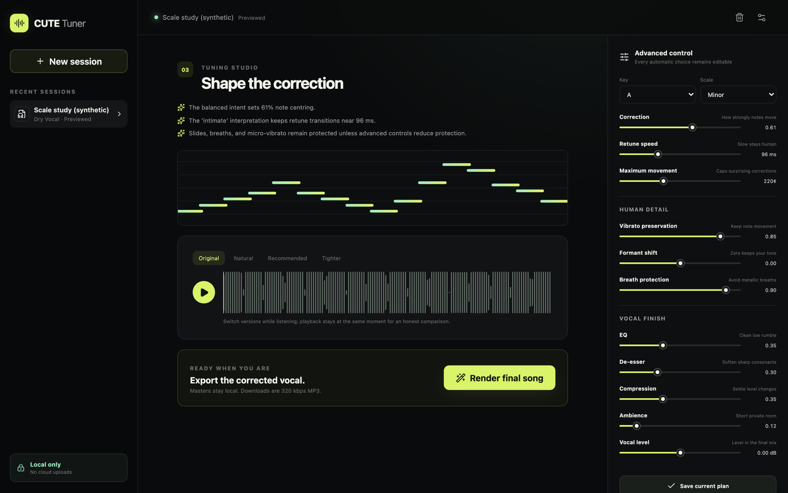

# CUTE Tuner Local Studio

CUTE Tuner is a private vocal-production studio that runs on your Mac. Upload a full song,
a dry vocal with its backing track, or a dry vocal alone. The studio analyses the take,
asks for your production intent, builds an editable tuning plan, renders three comparisons,
and exports a corrected vocal plus a finished mix as 320 kbps MP3 files.



No audio, lyrics, ratings, or model prompts leave the machine. The server binds only to
loopback and accepts local LLM endpoints only on `127.0.0.1`, `localhost`, or `::1`.

## Run the studio

Requirements: Python 3.11 or 3.12, [uv](https://docs.astral.sh/uv/), and FFmpeg.
[Rubber Band](https://breakfastquay.com/rubberband/) is optional but gives the
best-sounding renders. Node is needed only when changing the frontend because
the production build is committed.

```bash
brew install ffmpeg rubberband
```

```bash
uv sync --extra dev
uv run cutetuner ui
```

The command opens `http://127.0.0.1:8765`. Use `--no-open` when you do not want the browser
to open automatically. Projects live in the macOS application-data folder, not in the Git
checkout. Set `CUTETUNER_DATA_DIR` to use a different private directory for testing.
Set `CUTETUNER_LOW_MEMORY=1` to keep every neural analyser out of the workflow entirely;
full-song separation will stay paused until the flag is removed.

The base installation is deliberately light. It provides:

- WAV, FLAC, MP3, M4A, and AAC ingest through local FFmpeg;
- recording, pitch-behaviour, key, chord, and confidence analysis;
- a chord-aware sequence optimizer rather than independent nearest-note snapping;
- breath-aware correction, vibrato retention, maximum-movement limits, and protected ranges;
- Rubber Band continuous pitch-map rendering with formant preservation when installed;
- an inspectable PSOLA emergency renderer when Rubber Band is unavailable;
- restrained EQ, de-essing, compression, ambience, gain matching, and peak protection;
- synchronized A/B previews and both final MP3 exports;
- private ratings and a regularized local preference ranker after 20 comparisons.

## Quality models and RAM guard

Before any model-heavy operation, CUTE Tuner checks macOS memory pressure. Below 55% free
headroom it pauses stem separation and uses the lightweight pitch tracker instead of loading
neural weights. Full torchcrepe analysis runs in low-priority, two-thread child processes,
using 30-second chunks and 32-frame batches so PyTorch memory is released rather than retained
by the studio server. The UI shows the current headroom. Install the optional quality pack only
when the Mac has enough free memory:

```bash
./scripts/setup_quality.sh
```

This installs torchcrepe in the main environment, Audio Separator 0.44.5 in an isolated
Python 3.12 runtime, and CLAP plus SingMOS-Pro in a separate perception runtime. Full-song
mode uses the pinned `vocals_mel_band_roformer.ckpt`. All checkpoints download into CUTE
Tuner's application-data directory, are SHA-256 verified, and are listed with their versions
and licences in `models/MODEL_MANIFEST.json`. The total model budget is enforced at 5 GB.

CLAP and SingMOS-Pro remain optional quality signals, not artistic judges. They run offline
in one-shot subprocesses and are unloaded after each signal. When absent or paused for RAM,
the report labels its semantic descriptors and naturalness estimate as low-confidence local
proxies. It never presents a model prediction as a verdict about the performance.

## Connect an existing local GGUF model

Start your existing model with an OpenAI-compatible local server, for example llama.cpp's
`llama-server`. In **Settings → Models & privacy**, enter an endpoint such as
`http://127.0.0.1:8080/v1` and the server's model name. The model receives only the vibe text
and aggregate analysis facts. It can select one bounded production profile; it cannot edit
audio or invent arbitrary notes. If it is unavailable or gives an invalid answer, deterministic
planning takes over.

The older CLI remains compatible:

```bash
uv run cutetuner input.wav output.wav --key G --scale minor --strength 0.5 --retune-ms 110
uv run cutetuner auto vocal.wav backing.wav output.wav --vibe "intimate, aching, close"
```

## Test and verify

```bash
uv run ruff check src tests scripts
uv run pytest
pnpm --dir frontend install --frozen-lockfile
pnpm --dir frontend build
```

On an Apple M5 (16 GB, macOS 27) all of the above pass: ruff is clean, 16 tests
pass, and the rebuilt frontend is byte-identical to the committed `dist/`. A
synthetic tone 35 cents sharp comes out of `cutetuner input.wav output.wav --key A
--scale major --strength 1.0` within 3 cents of A4.

The automated suite covers decoding and upload validation, pitch tracking, key detection,
chord-aware targets, local-endpoint security, the producer brief, preview rendering, both
export paths, 320 kbps MP3 probing, deletion, and preference training. Tests use generated
tones only. Real vocals, renders, model files, and application data stay out of Git.

The app retains 24-bit WAV masters by default for rerenders. Disable this in Settings if you
prefer smaller storage. “Delete all local data” removes projects, outputs, ratings, settings,
downloaded models, and the isolated model runtime.

## Honest quality boundary

CUTE Tuner can measure and optimize technical evidence, but no current model understands a
performance exactly as a thoughtful human producer does. Final quality still depends on clean
recording, correct harmonic context, and your A/B choice. The UI blocks or warns on missing
harmony, insufficient voiced audio, weak key confidence, clipping, missing separation models,
and low RAM rather than silently claiming certainty.
